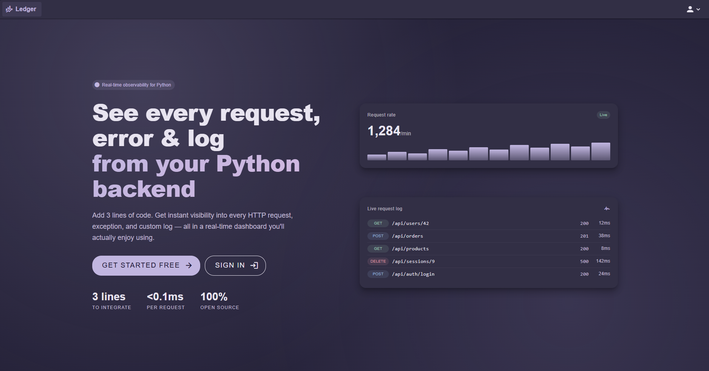
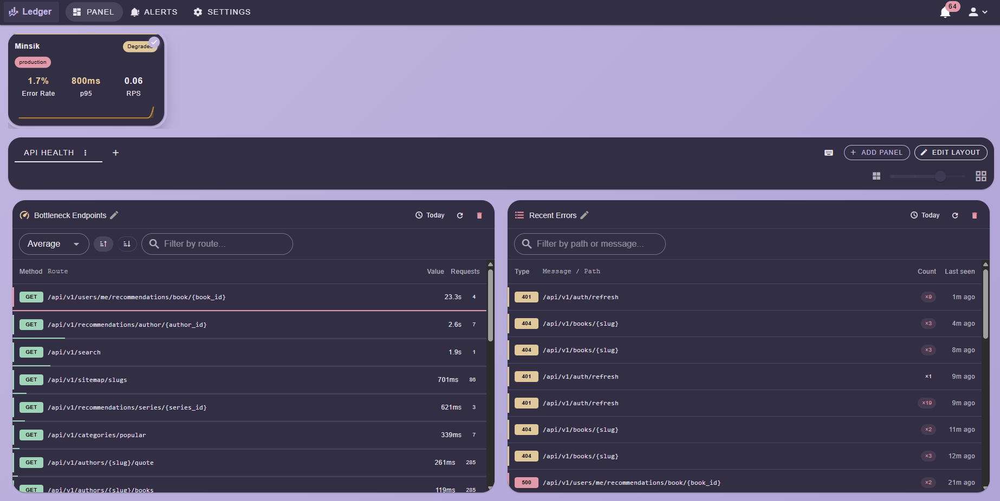
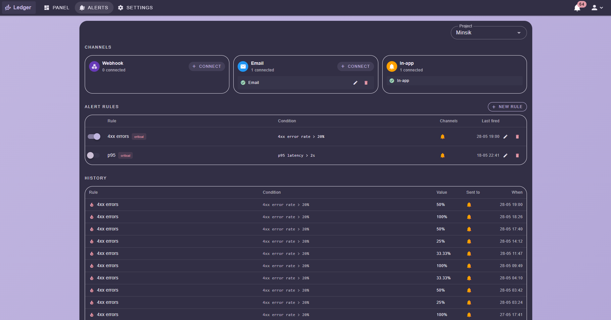

<div align="center">

# Ledger Dashboard

### Beautiful, real-time log analytics in your browser

[](https://opensource.org/licenses/MIT)
[](https://nuxt.com/)
[](https://vuejs.org/)

[Live Dashboard](https://ledger.jtuta.cloud) • [Setup Guide](https://ledger.jtuta.cloud/how-to-setup) • [Python SDK](https://github.com/JakubTuta/Ledger-SDK) • [Backend](https://github.com/JakubTuta/Ledger-APP) • [API Docs](https://bump.sh/tuta-corp/doc/ledger-api/)

</div>

---

**Try it now: [ledger.jtuta.cloud](https://ledger.jtuta.cloud)**

No installation required. Create an account and start exploring your logs in seconds.

**Connecting your app?** The in-app [Setup Guide](https://ledger.jtuta.cloud/how-to-setup) has
copyable, step-by-step instructions for basic SDK setup, custom metrics, distributed tracing, and
any OpenTelemetry SDK.

---

### Live Log Streaming

Watch logs appear in real-time as your application runs. Filter by level, time range, message content, or custom attributes. Jump to any point in your application's history.



<br>

### Custom Dashboards

Build your own monitoring layouts with drag-and-drop panels. Mix logs, metrics, and error rates. Layouts persist across sessions.



<br>

### Alerts & Monitoring

Threshold-based alerts delivered via in-app notifications, email, or webhook. Track error rates and log volume over time.



---

## Quick Start

**Prerequisites:** Node.js 18+, [bun](https://bun.sh/)

```bash
git clone https://github.com/JakubTuta/Ledger-WEB.git
cd Ledger-WEB

bun install
bun run dev
```

Open `http://localhost:3000`.

Create a `.env` file to point at your API server:

```env
# Local development
NUXT_PUBLIC_API_BASE_URL=http://localhost:8000

# Or use the hosted server
# NUXT_PUBLIC_API_BASE_URL=https://ledger-server.jtuta.cloud
```

---

## Ecosystem

- **[Setup Guide](https://ledger.jtuta.cloud/how-to-setup)** — Step-by-step SDK, metrics, tracing, and OTLP instructions
- **[Python SDK](https://github.com/JakubTuta/Ledger-SDK)** — Official client library ([PyPI](https://pypi.org/project/ledger-sdk/))
- **[Backend Server](https://github.com/JakubTuta/Ledger-APP)** — API server and infrastructure
- **[Live Demo](https://ledger.jtuta.cloud)** — Try it without installing
- **[API Reference](https://bump.sh/tuta-corp/doc/ledger-api/)** — Complete REST API docs

## License

MIT License — see [LICENSE](LICENSE) for details.
